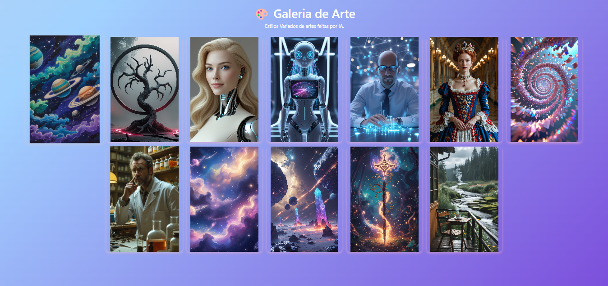

  <h1>
    
    
    
  </h1>
  

    
  

## Descrição 
A **Galeria de Arte de IA** é uma aplicação web simples e visualmente envolvente que apresenta obras de arte geradas por **Inteligência Artificial** em estilos variados. As imagens foram criadas utilizando ferramentas de IA como **LeonardoAI**, **GPT** e **AzureAI**, combinando modelos generativos com leitura de imagens e referências artísticas.

## Funcionalidades
- Exibe 12 imagens únicas geradas por IA em uma galeria com layout responsivo.
- Design com fundo gradiente animado para uma experiência mais imersiva.
- Efeitos de destaque ao passar o mouse nas imagens (hover effect).
- Código leve e sem dependência de backend, ideal para estudo de front-end visual.

## Testes de Software
- **Teste de Depuração:**
  - HTML, CSS e JS validados diretamente no navegador e no VSCode.
  - Console inspecionado para garantir ausência de erros.
- **Teste de Funcionamento:**
  - Verificado o comportamento responsivo da galeria e a fluidez da animação do fundo.
  - Inspecionadas interações de hover e carregamento das imagens, garantindo acessibilidade e desempenho fluido.
- **Captura do Teste Realizado:**

## Tecnologias e Linguagens

## Bibliotecas e Frameworks

## Documentação das Tecnologias
- [HTML5 - Documentação Oficial](https://developer.mozilla.org/pt-BR/docs/Web/HTML)
- [CSS3 - Documentação Oficial](https://developer.mozilla.org/pt-BR/docs/Web/CSS)
- [JavaScript - Documentação Oficial](https://developer.mozilla.org/pt-BR/docs/Web/JavaScript)
- [TypeScript - Documentação Oficial](https://www.typescriptlang.org/docs/)
- [Node.js - Site Oficial](https://nodejs.org/en/docs)
- [React - Documentação Oficial](https://react.dev/)
- [Angular - Documentação Oficial](https://angular.io/docs)
- [Vue.js - Documentação Oficial](https://vuejs.org/guide/introduction.html)
- [Bootstrap - Documentação Oficial](https://getbootstrap.com/docs/5.3/getting-started/introduction/)
- [TensorFlow.js - Documentação Oficial](https://js.tensorflow.org/)
- [GitHub Docs - Como usar o GitHub](https://docs.github.com/pt)

---

  Feito com 💗 por <a href="https://github.com/AraujoTech1" target="_blank">Fernanda</a>

